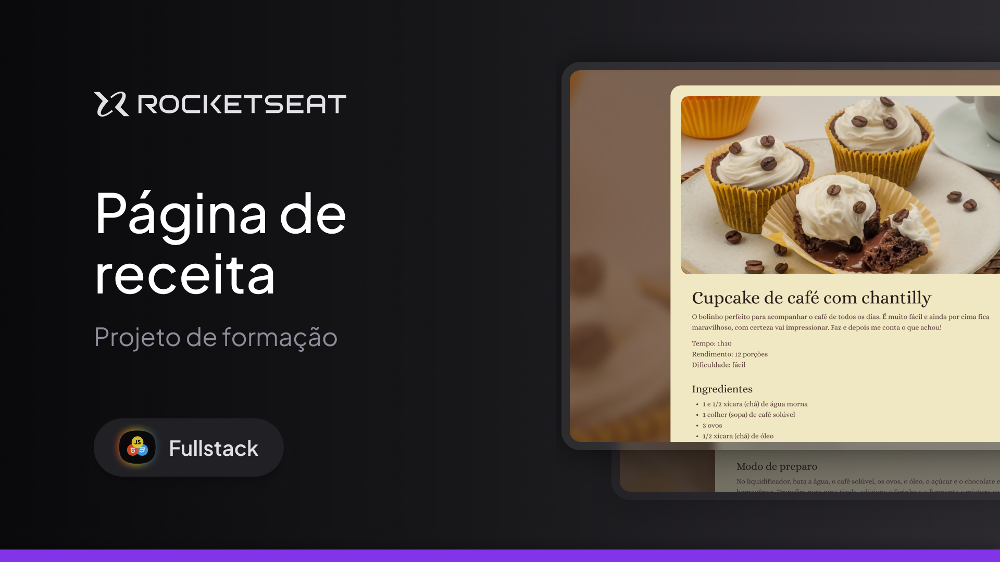

# 🧁 Receita: Cupcake de Café com Chantilly



Este projeto é uma página estática desenvolvida com **HTML e CSS** que apresenta uma receita deliciosa de **Cupcake de Café com Chantilly**.

---

## 🍰 Descrição

A ideia do projeto é simular uma receita real, organizando as seções de forma clara, bonita e responsiva, reforçando habilidades de layout e estilização com CSS.

---

## ✨ Funcionalidades

- ✅ Layout elegante com imagem principal da receita.
- 📋 Seção de ingredientes em lista.
- 🧑‍🍳 Passo a passo detalhado de preparo.
- 🎨 Tipografia personalizada com Google Fonts.
- 🖼️ Background com imagem temática.
- ❤️ Rodapé com assinatura e ícone estilizado.

---

## 🖼️ Prévia do Projeto


---

## ⚙️ Tecnologias Utilizadas

- HTML5
- CSS3

---

## 📁 Estrutura de Pastas

```
cupcake-receita/
│
├── assets/
│ ├── bg.jpg
│ ├── favicon.svg
│ ├── favicon.png (opcional)
│ ├── heart.svg
│ ├── main-image.jpg
│ └── project-cover.jpg
│
├── index.html
├── style.css
└── readme.md
```

---

---

## 📚 Aprendizados Aplicados

- Estrutura semântica com HTML5
- Criação de páginas temáticas com CSS puro
- Uso de fontes externas (Google Fonts)
- Organização de conteúdo culinário
- Boas práticas em estrutura de projeto front-end

---

## 👨‍🍳 Autor

Desenvolvido por **Rocketseat**  
Adaptado e implementado por **William Milanez**

---

## 📄 Licença

Este projeto é de uso educacional e livre para fins de estudo e prática pessoal.

---
